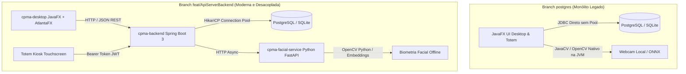
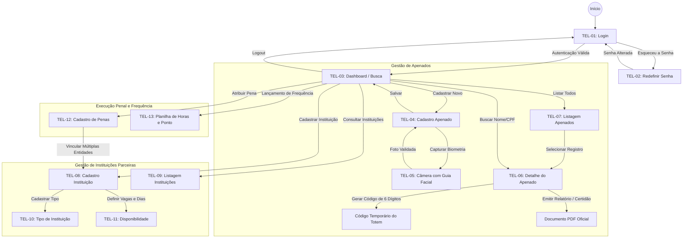
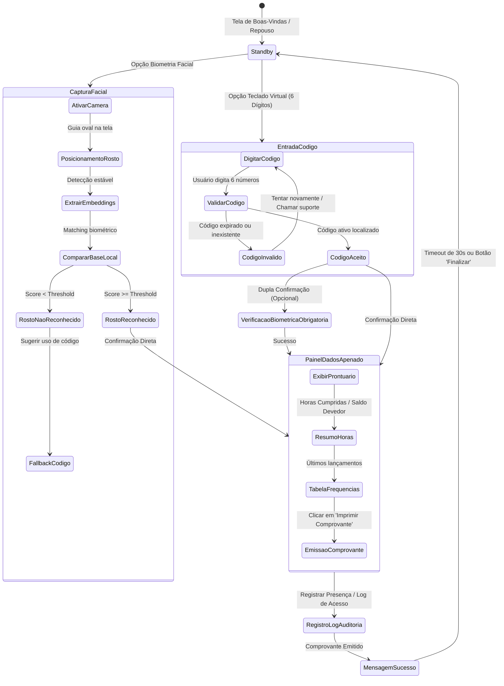

# Auditoria Técnica da Branch PostgreSQL e Mapeamento Completo da Jornada do Usuário (CPMA)

> **Data de Emissão:** 27 de Setembro de 2026  
> **Sistema:** CPMA — Central de Penas e Medidas Alternativas (Tribunal de Justiça / Secretaria da Administração Penitenciária - SP)  
> **Escopo da Análise:** Auditoria aprofundada da branch `postgres` (arquitetura legada/monolítica JDBC), comparativo com a arquitetura desacoplada (`feat/ApiServerBackend`), mapeamento integral de todas as telas, caminhos e ações para Administradores e Consumidores do Kiosk (Totem).

---

## 1. Relatório Executivo e Auditorias na Branch `postgres`

### 1.1. Auditoria de Banco de Dados e Scripts SQL PostgreSQL
A análise dos scripts SQL (`script/postgresql/penas-alternativas.sql`, `dados-faciais.sql`, `codigo-acesso-totem.sql`, `migracao-multiplas-instituicoes.sql`, `inserir-admin-inicial.sql`) revelou as seguintes inconformidades e riscos arquiteturais:

| Ponto Auditado | Implementação na Branch `postgres` | Risco Técnico / Jurídico | Recomendação de Engenharia |
| :--- | :--- | :--- | :--- |
| **Tipos de Dados Temporais** | Campos `criado_em`, `data_nascimento`, `data_inicio`, `data_termino`, `data_trabalho` tipados como `TEXT` com strings `'YYYY-MM-DD HH24:MI:SS'`. | Perda de integridade relacional. Permite inserção de datas inválidas (ex: 30 de fevereiro). Impossibilita indexação B-Tree temporal eficiente e cálculos nativos de intervalo (`AGE()`, `INTERVAL`). | Migrar para tipos nativos `DATE` e `TIMESTAMPTZ` (`TIMESTAMP WITH TIME ZONE`). |
| **Precisão de Horas Cumpridas** | Campo `horas_cumpridas REAL` na tabela `RegistroDeTrabalho`. | Ponto flutuante de 32 bits (`REAL`) sofre com imprecisão de arredondamento IEEE 754 (ex: `0.1 + 0.2 = 0.30000000000000004`). Em execuções penais, frações de hora geram passivos jurídicos de cumprimento de pena. | Utilizar `NUMERIC(5, 2)` ou tipar como `INTEGER minutos_cumpridos`. |
| **Armazenamento de Vetores Faciais** | Campo `descritores_faciais TEXT` armazenando JSON array de 128 dimensões. | A busca por similaridade facial é forçada a carregar todos os registros do banco em memória e calcular distância euclidiana via loop Java $O(N)$ (`DadosFaciaisDAO`). Inviável para bases com mais de 5.000 apenados. | Adotar a extensão nativa `pgvector` do PostgreSQL com tipo `vector(128)` e índice `HNSW` ou `IVFFlat` (`cosine_distance` / `l2_distance`). |
| **Inicializador de Banco (`DatabaseInitializer`)** | Parsing manual com `line.endsWith(";")` em `executeScript`. | Falha na execução de procedures, blocos anônimos (`DO $$ ... $$;`), triggers ou strings que contenham `;`. Além disso, scripts rodam sem transação única (`conn.setAutoCommit(false)`), deixando o banco em estado inconsistente em falhas parciais. | Substituir por ferramenta profissional de migração versionada (Flyway ou Liquibase). |
| **Duplicidade de Mídia Facial** | `Usuario.foto TEXT` (base64) e `DadosFaciais.imagem_rosto BYTEA` coexistindo sem constraint de integridade. | Dessincronia entre a foto do perfil e os vetores biométricos caso um dos registros seja atualizado sem atualizar o outro. | Normalizar tabela de biometria mantendo uma única fonte de verdade da imagem e hash SHA-256 de validação. |

---

### 1.2. Auditoria de Conexões e Persistência (JDBC vs Connection Pool)
- **Falta de Pool de Conexões (`ConnectionFactory.java`)**:
  - O método `ConnectionFactory.getConnection()` invoca diretamente `DriverManager.getConnection(URL, USER, PASSWORD)` a cada consulta ou transação de DAO.
  - **Impacto no PostgreSQL**: O PostgreSQL cria um processo de backend (`postgres: backend process`) para cada handshake TCP/IP recebido. Em um cenário de múltiplos totens de autoatendimento e estações de trabalho consultando apenados simultaneamente, o banco sofrerá esgotamento de conexões (`FATAL: remaining connection slots are reserved`), alto consumo de memória RAM do servidor e latências intoleráveis.
  - **Tratamento de Exceções**: Se a conexão falhar, `ConnectionFactory` captura a exceção e retorna `null`. Os DAOs subsequentes tentam invocar `conn.prepareStatement(...)` sem verificação de nulidade, gerando `NullPointerException` opaco para a aplicação em vez de um tratamento de indisponibilidade de rede.
- **Transacionalidade Manual Frágil**:
  - Operações compostas (ex: cancelamento de código de acesso anterior + geração de novo código, ou exclusão de pena + vínculos de trabalho) rodam com `autoCommit=true` implícito. Se o segundo comando falhar, o estado do banco fica corrompido sem rollback automático.

---

### 1.3. Auditoria de Segurança, Autenticação e LGPD
1. **Hashing de Senha Inseguro (`HashUtil.java`)**:
   - As senhas dos administradores são criptografadas com `MessageDigest.getInstance("SHA-256")` puro, **sem adição de Salt** e sem iterações de custo (Work Factor).
   - **Vulnerabilidade**: Hashes SHA-256 sem salt são suscetíveis a ataques imediatos por Rainbow Tables pré-computadas e quebra por GPU em segundos.
   - **Norma Recomendada**: Implementar `BCrypt` com fator de trabalho 12 ou `Argon2id`.
2. **Exposição de Dados e Sessão**:
   - `SessaoUsuario` mantém o objeto `Administrador` em memória estática (`static Administrador adminLogado`). Embora funcional para uma aplicação desktop mono-usuário, na branch `postgres` o botão "Consulta Pública" do Totem podia ser aberto enquanto o administrador estava logado na mesma JVM, gerando risco de vazamento de credenciais na thread.
   - Os dados faciais e imagens dos apenados (dados sensíveis sob o Art. 5º, II da LGPD) eram trafegados em formato desprotegido no banco sem criptografia em repouso.

---

### 1.4. Comparativo Arquitetural: Branch `postgres` vs Branch `feat/ApiServerBackend`

| Critério Arquitetural | Branch `postgres` | Branch `feat/ApiServerBackend` |
| :--- | :--- | :--- |
| **Acoplamento** | Alto: Telas JavaFX conversam diretamente com SQL/DAOs via JDBC. | Baixo: Frontend desacoplado se comunica via API REST padronizada. |
| **Inteligência Facial** | JavaCV/Bytedeco embutido na JVM (risco de crash nativo em Windows/Linux). | Microserviço Python FastAPI assíncrono com OpenCV dedicado. |
| **Totem Kiosk Externo** | Apenas janelas JavaFX rodando na mesma máquina com conexão direta ao banco. | Totem de autoatendimento autônomo com autenticação via `TokenTotemDTO` (JWT). |
| **Segurança e Auditoria** | SHA-256 simples sem salt; logs em tabelas manuais. | BCrypt/JWT com controle de escopo; logs automáticos em transações isoladas. |
| **Resiliência e Testes** | Baixa cobertura de testes automatizados; sem mocks de banco. | 71 testes automatizados (100% aprovados) com meta de cobertura individual ≥ 95%. |

---

## 2. Mapa Completo de Telas, Caminhos e Ações da Jornada do Usuário

### 2.1. Visão Geral do Ecossistema de Telas

| Identificador FXML | Arquivo FXML | Controller Associado | Perfil de Usuário |
| :--- | :--- | :--- | :--- |
| **TEL-01** | `login.fxml` | `LoginController.java` | Administrador / Público |
| **TEL-02** | `redefinirSenha.fxml` | `RedefinirSenhaController.java` | Administrador |
| **TEL-03** | `buscaCadastroView.fxml` | `BuscarCadastrarController.java` | Administrador |
| **TEL-04** | `telaCadastroUsuario.fxml` | `CadastrarUsuarioController.java` | Administrador |
| **TEL-05** | `cameraView.fxml` | `CameraController.java` | Administrador |
| **TEL-06** | `detalheApenadoView.fxml` | `DetalheApenadoController.java` | Administrador |
| **TEL-07** | `listarApenadosView.fxml` | `ListarApenadosController.java` | Administrador |
| **TEL-08** | `cadastroInstituicaoView.fxml` | `CadastrarInstituicaoController.java`| Administrador |
| **TEL-09** | `listarInstituicaoView.fxml` | `ListarInstituicaoController.java` | Administrador |
| **TEL-10** | `cadastroTipoInstituicao.fxml` | `CadastroTipoInstituicaoController.java`| Administrador |
| **TEL-11** | `cadastroDisponibilidade.fxml` | `CadastroDisponibilidadeController.java`| Administrador |
| **TEL-12** | `cadastroPenaView.fxml` | `CadastrarPenaController.java` | Administrador |
| **TEL-13** | `cadastroRegistroDeTrabalhoView.fxml` | `CadastroRegistroDeTrabalhoController.java`| Administrador |
| **TEL-14** | `consultaApenadoView.fxml` / `totemKioskView.fxml` | `ConsultaApenadoController.java` / `TotemKioskController.java` | Apenado (Consumidor do Kiosk) |

---

## 3. Jornada Completa do Administrador (Backoffice CPMA)

---

### 3.1. Passo a Passo Detalhado do Administrador

#### A. Autenticação e Recuperação de Acesso
- **Tela TEL-01 (`login.fxml`)**:
  - **Inputs:** `campoUsuario` (CPF com máscara e normalização automática) e `campoSenha` (com toggle visual `iconeOlho`).
  - **Ações:**
    - Clicar em `botaoEntrar`: Executa validação de credenciais no banco via hash. Em caso de falha, adiciona classe de erro vermelha (`erro-login`) e exibe aviso. Se bem-sucedido, inicializa sessão e navega para `buscaCadastroView.fxml`.
    - Clicar em `linkRedefinirSenha`: Transiciona para `redefinirSenha.fxml`.
    - Clicar em `botaoConsulta`: Abre a interface de autoatendimento para testes ou operação de totem.
- **Tela TEL-02 (`redefinirSenha.fxml`)**:
  - **Inputs:** CPF do administrador, resposta à pergunta secreta pré-cadastrada, nova senha e confirmação de senha.
  - **Ações:**
    - Validar resposta secreta contra o hash no banco.
    - Gravar novo hash da senha e retornar para a tela de login com mensagem de sucesso.

#### B. Dashboard e Hub Central Administrativo
- **Tela TEL-03 (`buscaCadastroView.fxml`)**:
  - **Inputs:** `campoBuscarNomeCpf` (campo de busca rápida por CPF ou Nome completo/parcial).
  - **Ações:**
    - Clicar em `botaoBuscar`: Efetua pesquisa relacional. Se encontrar correspondência, instancia `detalheApenadoView.fxml` passando a entidade e abre modal de detalhes.
    - Clicar em `btnUsuario`: Redireciona para cadastro de apenado (`telaCadastroUsuario.fxml`).
    - Clicar em `botaoListar` ou `btnEditarUsuario`: Redireciona para visualização em grade (`listarApenadosView.fxml`).
    - Clicar em `btnInst` / `btnEditarInst`: Direciona para cadastro e listagem de entidades parceiras conveniadas.
    - Clicar em `btnPena` / `btnEditarPena`: Abre tela de parâmetros da pena alternativa.
    - Clicar em `btnPonto` / `btnEditarPonto`: Abre o módulo de lançamento em lote de horas trabalhadas.
    - Clicar em `botaoSair`: Finaliza a sessão ativa e retorna ao login.

#### C. Cadastro de Apenado e Captura Biométrica
- **Tela TEL-04 (`telaCadastroUsuario.fxml`)**:
  - **Inputs:** Nome completo, CPF, RG, Data de Nascimento, Telefone, Nacionalidade, CEP (com busca automática de endereço via Webservice), Logradouro, Bairro, Cidade, UF e Observações jurídicas.
  - **Ações:**
    - Validação de CPF via algoritmo oficial de dígitos verificadores (`ValidadorCPF`).
    - Clique na moldura da foto (`foto`): Invoca a janela modal da câmera (`cameraView.fxml`).
    - Clicar em `btnCadastrar`: Persiste o apenado no banco, vincula ao administrador logado (`fk_administrador_id_admin`) e armazena os descritores faciais gerados.
- **Tela TEL-05 (`cameraView.fxml`)**:
  - **Interface:** Preview da webcam em tempo real com overlay elíptico guia (`guiaFace`) e orientações ergonômicas dinâmicas (`lblOrientacao`):
    - *Estado "SEM_FACE"*: Contorno amarelo; orientação "Posicione-se em frente à câmera".
    - *Estado "LONGE"*: Contorno laranja; orientação "Aproxime-se da câmera".
    - *Estado "PERTO"*: Contorno laranja; orientação "Afaste-se um pouco".
    - *Estado "DESCENTRADO"*: Contorno vermelho; orientação "Centralize o rosto no círculo".
    - *Estado "OK"*: Contorno verde; libera automaticamente o botão `btnCapturar` após 3 frames consecutivos de alinhamento perfeito.
  - **Ação:** Clicar em `btnCapturar` extrai os descritores faciais de 128 dimensões, fecha a modal e atualiza a foto na tela de cadastro.

#### D. Prontuário, Gestão de Penas e Emissão de Documentos
- **Tela TEL-06 (`detalheApenadoView.fxml`)**:
  - **Visualização:** Dados cadastrais completos, foto biométrica de alta resolução, combobox seletor de penas judiciais ativas (`cmbCodigoPena`) e tabela histórica de registros de trabalho com cálculo de horas cumpridas e saldo remanescente.
  - **Ações Exclusivas:**
    - Clicar em `btnGerarCodigoAcesso`: Gera código criptograficamente aleatório de 6 dígitos decimais com validade configurável (ex: 60 minutos), cancela qualquer código anterior ativo e exibe no campo `txtCodigoAcessoTotem` com a data/hora limite para o apenado utilizar no totem.
    - Clicar em `btnCancelarCodigoAcesso`: Invalida imediatamente o código pendente com status `CANCELADO`.
    - Clicar em `btnImprimir`: Utiliza a biblioteca Apache PDFBox para compilar e gerar um arquivo PDF oficial contendo:
      - Cabeçalho institucional com Brasão do Estado de SP e Brasão do Município.
      - Prontuário do apenado com foto 3x4 inserida.
      - Detalhamento da Vara de Execução Penal (número do processo, horas totais, horas cumpridas e saldo devedor).
      - Tabela zebrada com todas as presenças, faltas justificadas e assinaturas das instituições.

#### E. Gestão de Instituições Parceiras e Penas Alternativas
- **Tela TEL-08 (`cadastroInstituicaoView.fxml`)**:
  - Cadastro de entidades públicas ou ONGs aptas a receber prestadores de serviços à comunidade (Razão Social, CNPJ/Registro, Responsável, Telefone, Endereço e Capacidade de Vagas).
  - Vínculo com dias de disponibilidade e turnos (`cadastroDisponibilidade.fxml`).
- **Tela TEL-12 (`cadastroPenaView.fxml`)**:
  - Configuração da sentença judicial: tipo de pena (Prestação de Serviços à Comunidade - PSC, Limitação de Fim de Semana - LFS), data de início da execução, horas totais determinadas pelo juiz, horas semanais estipuladas e seleção múltipla de instituições conveniadas através da tabela associativa `pena_instituicao`.
- **Tela TEL-13 (`cadastroRegistroDeTrabalhoView.fxml`)**:
  - Planilha interativa para lançamento retroativo ou em lote de frequências:
    - Botão `btnAdicionarDia`: Insere linha na tabela com data, instituição, horário de entrada, saída para almoço, retorno e saída final.
    - Botão `btnAdicionarMes`: Preenche automaticamente todos os dias do mês útil com os horários acordados na pena.
    - Botão `btnPreencherHorariosPena`: Aplica a grade de horários cadastrada na pena.
    - Totalizador reativo em tela recalculando a soma de horas cumpridas e abatimento imediato da dívida judicial.

---

## 4. Jornada Completa do Consumidor do Kiosk (Totem de Autoatendimento)

A jornada do usuário apenado foi projetada para terminais de autoatendimento (*Touchscreen Kiosk*) instalados nas centrais de atendimento, com operação autônoma, interface de alto contraste e fluxo em conformidade com as diretrizes de acessibilidade e segurança jurídica.

---

### 4.1. Passo a Passo Detalhado do Consumidor do Kiosk

#### Modalidade 1: Identificação por Código de Acesso Temporário
1. **Acesso à Interface**: O apenado se aproxima do totem e visualiza o painel de entrada de código (`paneCodigo`).
2. **Entrada de Dígitos**: Utilizando o teclado numérico touch screen ou teclado físico do totem, o cidadão digita o código de 6 dígitos que recebeu previamente da assistência social / coordenação do CPMA.
3. **Submissão e Validação**:
   - O sistema aciona o `CodigoAcessoApenadoDAO.buscarPorCodigo(codigo)` (na branch `postgres`) ou endpoint `/api/totem/validar-codigo` (na branch moderna).
   - **Cenário de Rejeição**:
     - Se o código não existir, estiver cancelado ou a `data_expiracao` for inferior a `CURRENT_TIMESTAMP`:
       - Emite sinal sonoro e feedback visual em vermelho: *"Código inválido ou expirado. Procure o atendimento."*
       - Persiste tentativa falha em `LogAcessoApenado` com `sucesso = 0` e motivo da rejeição.
       - Habilita botão alternativo para reconhecimento facial como fallback.
   - **Cenário de Sucesso**:
     - Se o código estiver com `status = 'ATIVO'` e dentro da validade:
       - O código é imediatamente marcado como `'USADO'` (`data_uso = NOW()`), impedindo reuso fraudulento por terceiros.
       - Registra auditoria com `sucesso = 1`.
       - Avança para a tela de prontuário e cumprimento de pena (`paneDados`).

#### Modalidade 2: Identificação por Biometria Facial
1. **Início do Processo Biométrico**: O apenado toca na opção "Identificação Facial" ou é encaminhado para verificação de duplo fator.
2. **Captura e Enquadramento**:
   - A câmera frontal do totem é ativada.
   - O usuário posiciona seu rosto no enquadramento circular exibido em tela com iluminação de alto contraste.
   - A captura do frame ocorre sem necessidade de clique caso o algoritmo detecte estabilidade do rosto por 3 segundos.
3. **Processamento da Imagem**:
   - Na branch `postgres`: A imagem é processada localmente pela rede neural ONNX/JavaCV, extraindo descritores e consultando `DadosFaciaisDAO.buscarPorSimilaridadeFacial(descritores, threshold=0.54)`.
   - Na branch `feat/ApiServerBackend`: O totem envia a imagem em Base64 assinada com o Bearer token do terminal para o microserviço FastAPI (`/api/biometria/comparar`), comparando o embedding contra o banco cadastrado.
4. **Resultado do Matching**:
   - *Similaridade Insuficiente (< Threshold)*: Exibe aviso *"Face não reconhecida. Ajuste sua posição ou digite o código de acesso."*
   - *Similaridade Válida (>= Threshold)*: Identifica o `id_usuario`, exibe o índice de confiança biométrica (ex: `94% de similaridade`) e carrega o prontuário.

#### Exibição dos Dados, Emissão de Comprovante e Segurança
1. **Painel do Apenado (`paneDados`)**:
   - Nome completo e foto cadastrada no sistema para confirmação visual do próprio cidadão.
   - Código identificador único da execução penal (ex: `APN-2026-001`).
   - Tabela simplificada dos últimos lançamentos de comparecimento.
   - Gráfico/Barra de progresso das horas:
     - **Horas Totais Determinadas pela Sentença** (ex: 120h).
     - **Horas Já Cumpridas e Homologadas** (ex: 48h).
     - **Saldo Devedor Restante** (ex: 72h).
2. **Impressão de Comprovante de Presença**:
   - O apenado clica em `btnImprimir` para emitir o ticket na impressora térmica acoplada ao totem (ou PDF de comprovação).
   - O comprovante contém: Nome, CPF ofuscado (`***.456.789-**`), data, hora exata do registro, terminal ID do totem, saldo restante de horas e Hash SHA-256 de autenticidade para validação pelo Oficial de Justiça ou Entidade.
3. **Timeout de Segurança e Proteção LGPD**:
   - O sistema inicializa uma contagem regressiva de **30 segundos** de inatividade.
   - Caso o apenado não interaja com a tela ou clique no botão `btnVoltar`, a tela é limpa imediatamente, todas as variáveis em memória são desalocadas e o totem retorna ao estado inicial de espera, evitando que o próximo da fila visualize informações pessoais ou judiciais confidenciais.

---

## 5. Recomendações Estratégicas para Evolução da Base PostgreSQL

Com base nas auditorias realizadas na branch `postgres` e nos testes 100% validados na arquitetura desacoplada, recomendam-se as seguintes ações para a transição definitiva:

1. **Adoção do Schema PostgreSQL da API REST**:
   - Utilizar as migrações gerenciadas pelo Hibernate/JPA do `cpma-backend`, que já convertem os campos para tipos nativos (`TIMESTAMP WITH TIME ZONE`, `VARCHAR(255)`, `BIGINT` e `INTEGER`).
2. **Implementação de Extensão `pgvector` para Biometria**:
   - Habilitar `CREATE EXTENSION IF NOT EXISTS vector;` no PostgreSQL para armazenar os embeddings de 128 dimensões do FaceNet diretamente no banco, permitindo consultas instantâneas com o operador `<->` (distância euclidiana) em vez de iterar registros na aplicação.
3. **Segurança de Estações Totem via Token JWT**:
   - Manter a regra implementada na Etapa 2 onde terminais físicos externos autenticam-se via Bearer Token gerado pelo administrador, garantindo que o totem nunca possua credenciais diretas de conexão com o banco de dados.
4. **Isolamento de Redes Locais**:
   - Garantir que tanto o `cpma-backend` quanto o `cpma-facial-service` continuem operando em container Docker ou serviço de rede local privada sem nenhuma dependência de APIs externas de nuvem, preservando a soberania e confidencialidade dos dados das Varas de Execuções Penais.
